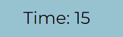
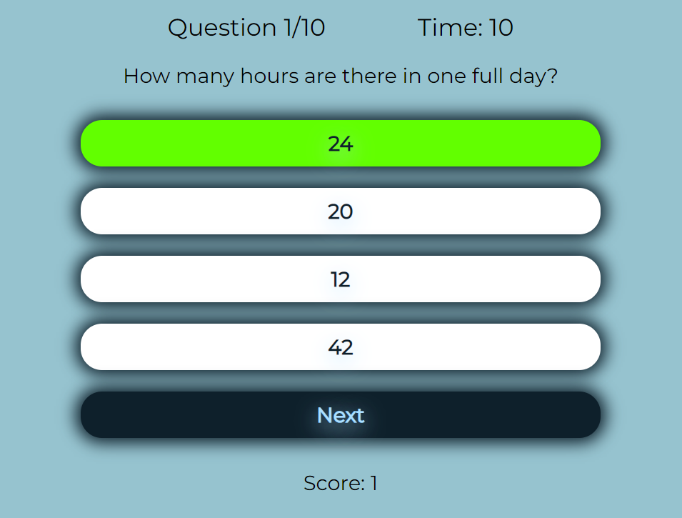
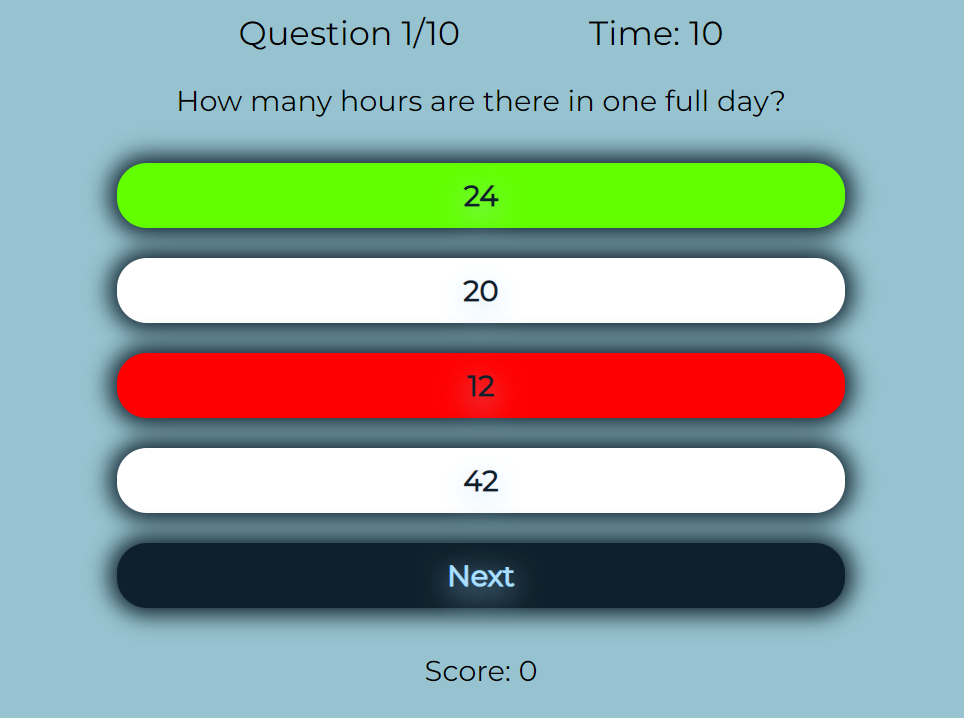

# The Everything Quiz

## User Experience

### User Stories
As a user I want to:

* test my general knowledge with a quiz.
* be able to initiate the start of the quiz.
* be able to understand how to take the quiz.
* be able to select a difficulty before starting the quiz.
* know my current score.
* know how far along the quiz I am.
* know whether my answer is correct or wrong.
* know my final score.
* be able to take the quiz again after completion.

## Site Structure

The site is made up of a single page which displays the main menu and heading upon loading. It then displays and hides different content depending on the actions of the user. More information on the different site features can be found in the [features](#features) section.

### Wireframes

I created basic wireframes of how I wanted the layout of the site to look using [Balsamiq](https://balsamiq.com/).

* The final version of the site differs in some ways because of changes that were made during the development phase.
    * The first most obvious change was the addition of buttons to the top right corners of the difficulty menu and quiz area.
        * These buttons were added to provide the user with a way of exiting the difficulty menu or quiz at any time without having to refresh the page.
    * Another obvious change is in the completed quiz display where the buttons contain different text to the ones in the wireframe.
        * This was done to create a better user experience by providing a way to return to the main menu as well as take another quiz instead of just being able to take another quiz or change the quiz difficulty.
        * The final outcome can be viewed in the [completed quiz display](#the-completed-quiz-display).

#### Home Page Wireframe

#### Rules Wireframe

#### Difficulty Wireframe

#### Quiz Wireframe

#### Results Wireframe

## Design Choices

### Font
* The font used throughout the site is "montserrat" with "sans-serif" as the secondary font.
    * I chose this particular font because I wanted something simple and easy to read.
    * The fact that the user will need to be able to quickly read the questions and the answer options in the quiz means that the font should ideally be well defined and easy to read.

### Colour Palette

* The colour palette was chosen with the help of [coolers](https://coolors.co/) and was based mainly on the colour blue as I wanted to use a calm colour to help relax and focus users during the quiz.
* Although the blue is a calming colour, it is also highly adaptable which made it useful for creating contrast and an overall good visual effect using different shades along with the green and red.
    * I used the darkest shade of blue (0E202B) to create a dark background to ensure the foreground stands out and that nothing distracts from the quiz area. I also used it for the buttons background to make them stand out in the containers while keeping with the overall design.
    * I used the dark sky blue (96C3CF) for the backgrounds of containers to bring the foreground content forwards by creating contrast while still maintaining a simple background.
    * The uranian blue (ABDFFF) was used for some of the text in the buttons and as shadows to create a glowing effect.
    * The main use for the green (62FF00) is to provide feedback on which answer is correct. It is also used for hover effects on all buttons excluding the quiz answer buttons in order to provide feedback when the user hovers them.
    * The red (FF0000) is used to provide feedback on which answers are wrong.

## Features

The Everything Quiz is designed to be an easy to use and interactive site with features that work on devices of various sizes.

### Existing Features

* #### The Heading
    * The heading is featured on the landing page above the main menu.
    * It is styled to be captivating and its contents refer to the purpose of the site.
    * This helps users to understand what the site is about and creates a positive first impression.

    

* #### The Main Menu
    * On the landing page is a main menu situated directly under the heading.
    * This contains text to entice the user to take part in a quiz as well as buttons to view the quiz rules or initiate a quiz.

    

* #### The Rules Modal
    * The rules modal is accessed through the "rules" button in the main menu.
    * It contains a list of rules for the quiz.
    * At the top right corner of the modal is a button to exit the rules modal and return to the main menu.
    * This is useful to users to learn how the quiz works and what the rules are when taking part.

    

* #### The Difficulty Menu
    * The difficulty menu is accessed through the "take the quiz" button in the main menu.
    * It contains buttons with options to set the difficulty of the quiz, either easy, medium or hard.
    * Once one of the option buttons is clicked, the quiz associated with the selected difficulty begins.
    * At the top right corner of the modal is a button to exit the difficulty menu and return to the main menu.
    * This is useful for users to be able to choose the difficulty level of the quiz before they begin.

    

* #### The Quiz Area
    * Once the user has selected a difficulty, the quiz area is displayed and the quiz begins.

    

    * In the top right corner of the quiz area is a button to quit the quiz.
    * This is useful for the user to be able to exit the quiz at any time without having to refresh the page.

    

    * At the top of the quiz area is the question number which changes depending on which question the user is on out of 10.
    * This is useful for the user to keep track of how far along the quiz they are.

    

    * Next to the question number is the timer which displays the amount of time left to answer the current question.
    * This is useful for the user to know how much time they have left to answer the question.

    

    * Just below the question number and timer is where the question and the answer options are displayed.
    * This is very useful to the user as it provides the question as well as a list of options to choose from for the answer.

    

    * At the bottom of the quiz area the current score is displayed.
    * This is useful for the user to keep track of their score.

    

* #### The Next Button
    * The next button is displayed at the bottom of the quiz area if the user answers a question or if the time runs out.
    * This is useful for users to be able to move on to the next question in the quiz.

     

* #### The Correct Answer Display
    * If the user clicks on the correct answer, the selected answer will be highlighted in green and the score will increment by 1.

    

* #### The Incorrect Answer Display
    * If the user clicks on an incorrect answer, the selected answer will be highlighted in red and the correct answer will be highlighted in green to inform the user which answer was correct.

    

* #### The Time Up Display
    * If the user does not answer a question within the given time, an alert appears to inform the user that the time has run out.

    

    * After the user clicks the "Okay" button in the alert, the correct answer is highlighted in green while the incorrect answers are highlighted in red.

    

* #### The Completed Quiz Display
    * At the end of the quiz, the quiz area is replaced by a completed quiz display.
    * This informs the user that the quiz is complete.
    * The final score out of 10 is presented to the user.
    * Buttons to retry or return to the main menu are made available.
    * This is a valuable feature as it informs the user about the completion of the quiz and provides them with options to go back to the landing page or take another quiz.

     

## Technologies Used

* [Balsamiq](https://balsamiq.com/wireframes/)
    * Used to create the wireframes during planning stage of the site.

* [HTML5](https://html.spec.whatwg.org/)
    * Used to add structure and content to the site.

* [CSS](https://www.w3.org/Style/CSS/Overview.en.html)
    * Used to add style to the HTML.

* [JavaScript](https://www.javascript.com/)
    * Used to enhance functionality and interactivity throughout the site.

* [Gitpod](https://www.gitpod.io/#get-started)
    * Used to creat the code and content for the repository.

* [Github](https://github.com/)
    * Used to store the repository and deploy the site.
    
## Testing

Click [here](TESTING.md) for information on testing the site.

## Deployment and Development

### Deploying the Site

* The site was deployed using github pages through the following steps:
1. In the "the-everything-quiz" github repository ,click on "settings".
2. Scroll down and click on the "pages" tab.
3. In the dropdown menu for the branch, select "main".
4. Click on "save".
5. Refresh the page to view the deployed website link.

### Forking the Repository

* Through github you can also fork the repository.
    * This can be done to create a copy of the repository in order to edit it without affecting the original repository.
    * The steps to fork the repository are listed as follows:

    1. In the "the-everything-quiz" repository, click on the "fork" tab in the top right corner.
    2. Click on "create fork" to fork the repository.

    

### Cloning the Repository

* Github can also be used to clone the repository.
    * This can be done to create a local copy of the repository on a computer.
    * The steps to clone the repository are as follows:

    1. In the "the-everything-quiz" repository, select the "code" tab located  just above the list of files and next to the gitpod button.
    2. Select https in the dropdown menu.
    3. Copy the url under https.
    4. Open Git Bash.
    5. Change the current working directory to the location where you want the cloned directory to be created.
    6. Type "git clone" and paste the url that was copied from the repository.
    7. Press the "enter" key to create the clone.

    
## Credits

## Acknowledgements