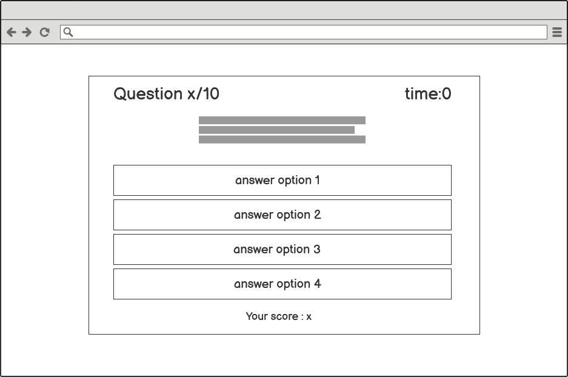

# The Everything Quiz

## User Experience

### User Stories
As a user I want to:

* test my general knowledge with a quiz.
* be able to initiate the start of the quiz.
* be able to understand how to take the quiz.
* be able to select a difficulty before starting the quiz.
* know my current score.
* know how far along the quiz I am.
* know whether my answer is correct or wrong.
* know my final score.
* be able to take the quiz again after completion.

## Site Structure

### Wireframes

I created basic wireframes of how I wanted the layout of the site to look using [Balsamiq](https://balsamiq.com/).

#### Home Page Wireframe

#### Rules Wireframe

#### Difficulty Wireframe

#### Quiz Wireframe

#### Results Wireframe

## Features

## Technologies Used

## Testing

## Deployment and Development

## Credits

## Acknowledgements