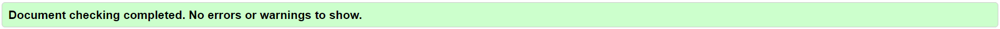
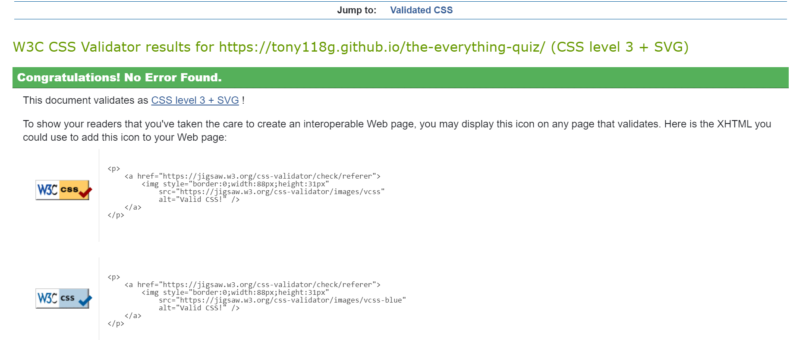
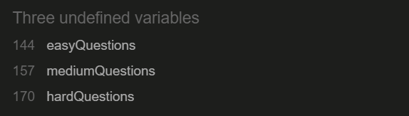
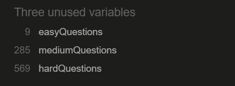
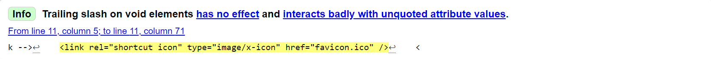
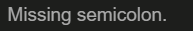
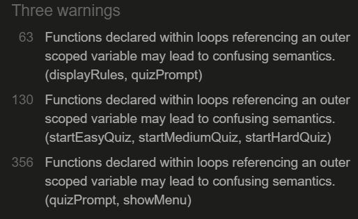

# Testing

## Code Validation
All code for the site has been tested thoroughly.
* All HTML code has been run through the [W3C HTML Validator](https://validator.w3.org/).
    * A few warnings were presented when testing the HTML code.
* All CSS code has been run through the [W3C CSS Validator](https://jigsaw.w3.org/css-validator/).
    * No warnings or errors were presented when testing the CSS code.
* All JavaScript code has been run through [JSHint](https://jshint.com/).
    * A few warnings were presented when testing the JavaScript code.

After making the necessary adjustments to the code, no errors or warnings were presented 
* For more information on the warnings that were presented, please go to the [known Bugs](#known-bugs) section.

### W3C HTML Validator Final Results

### W3C CSS Validator Final Results

### JSHint Final Results

#### Main Script (script.js)
* No warnings are shown.
* When the code from the main script is tested in JSHint it shows that there are 3 undefined variables which are named as easyQuestions, mediumQuestions, and hardQuestions.
    * This is because these variables have been defined in another script (questions.js)

#### Script Containing Questions (questions.js)
* No warnings are shown.
* When the code from the script containing the questions is tested in JSHint it shows that there are 3 unused variables which are the same variables shown as undefined in the main script (script.js).
    * This is because the functions are used in another script (script.js).

## Responsiveness

## Browser Compatibility

## Testing User Stories

## Known Bugs

### Resolved

During code validation the following warnings were presented:

* #### In the HTML:

    
    * This was due to an accidental placement of a forward slash after the href attribute in the link for the favicon.
    * This was resolved by simply removing the forward slash.

* #### In both JavaScript files:

    

    * This warning was shown for multiple lines of code where there was a missing semicolon.
    * The warning was cleared once the semicolons were added in the required places.

* #### In the main JavaScript file:

    
    * These warnings were a result of functions being declared inside loops referencing an outer scoped variable.
    * Although the code worked as intended, the warning indicated it may lead to confusing semantics.
    * This was resolved by replacing the for loops that were used to iterate through buttons with the "forEach" method. Once this was done, the warning was cleared.

#### Other significant amendments are listed below

* Once the user completed a quiz or part of a quiz and their score had been incremented, the score would stay the same when another quiz was initiated and would not reset to 0.
    * This was fixed by creating a JavaScript function that resets the score to 0 whenever the quit button or end of quiz buttons are clicked.

* The timer would not stop when the user answered a question or when the time was less than 0.
    * This was resolved by using clearInterval() to clear the interval for the timer when necessary and then resetting the interval when the timer needed to start again.

* The user was able to click on answers repeatedly on the same question.
    * This was resolved through the following steps:
        1. Adding an event listener to the answer buttons to listen for a click.
        2. Once clicked, add a class of "no-pointer" to the answer area class list.
        3. Style the class of "no-pointer" to not allow clicks.
        4. Remove the "no-pointer" class again when a new question is initiated.

## Additional Testing